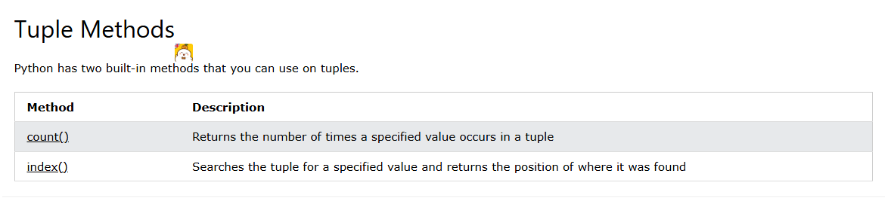

# Tuples
- Tuples are used to store multiple items in a single variable.

- Tuple is one of 4 built-in data types in Python used to store collections of data, the other 3 are List, Set, and Dictionary, all with different qualities and usage.

- A tuple is a collection which is ordered and unchangeable.

- Tuples are written with round brackets.
```
thistuple = ("apple", "banana", "cherry")
print(thistuple)
```
### Tuple Items
- Tuple items are ordered, unchangeable, and allow duplicate values.

- Tuple items are indexed, the first item has index [0], the second item has index [1] etc.

### Ordered
- When we say that tuples are ordered, it means that the items have a defined order, and that order will not change.

### Unchangeable
- Tuples are unchangeable, meaning that we cannot change, add or remove items after the tuple has been created.
### Allow Duplicates
- Since tuples are indexed, they can have items with the same value:
```
thistuple = ("apple", "banana", "cherry", "apple", "cherry")
print(thistuple)
```
### Tuple Length
- To determine how many items a tuple has, use the len() function:
```
thistuple = ("apple", "banana", "cherry")
print(len(thistuple))
```
### Create Tuple With One Item

- To create a tuple with only one item, you have to add a comma after the item, otherwise Python will not recognize it as a tuple.
```
thistuple = ("apple",)
print(type(thistuple))

#NOT a tuple

thistuple = ("apple")
print(type(thistuple))
```
### Tuple Items - Data Types
```
tuple1 = ("apple", "banana", "cherry")
tuple2 = (1, 5, 7, 9, 3)
tuple3 = (True, False, False)
```
- A tuple can contain different data types:
```
tuple1 = ("abc", 34, True, 40, "male")
```
### type()
- From Python's perspective, tuples are defined as objects with the data type 'tuple':
```
<class 'tuple'>
mytuple = ("apple", "banana", "cherry")
print(type(mytuple))

```
### The tuple() Constructor
- It is also possible to use the tuple() constructor to make a tuple.
```
thistuple = tuple(("apple", "banana", "cherry")) # note the double round-brackets
print(thistuple)
```
## Access Tuple Items
- You can access tuple items by referring to the index number, inside square brackets:
```
thistuple = ("apple", "banana", "cherry")
print(thistuple[1])
```
### Negative Indexing
- Negative indexing means start from the end.

- -1 refers to the last item, -2 refers to the second last item etc.

```
thistuple = ("apple", "banana", "cherry")
print(thistuple[-1])
```
### Range of Indexes
- You can specify a range of indexes by specifying where to start and where to end the range.

- When specifying a range, the return value will be a new tuple with the specified items.
```
thistuple = ("apple", "banana", "cherry", "orange", "kiwi", "melon", "mango")
print(thistuple[2:5])
```
- This example returns the items from the beginning to, but NOT included, "kiwi":
```
thistuple = ("apple", "banana", "cherry", "orange", "kiwi", "melon", "mango")
print(thistuple[:4])
```
- By leaving out the end value, the range will go on to the end of the tuple:
```
thistuple = ("apple", "banana", "cherry", "orange", "kiwi", "melon", "mango")
print(thistuple[2:])
```
### Range of Negative Indexes
- Specify negative indexes if you want to start the search from the end of the tuple:
```
thistuple = ("apple", "banana", "cherry", "orange", "kiwi", "melon", "mango")
print(thistuple[-4:-1])
```
## Update Tuples
### Change Tuple Values
- Once a tuple is created, you cannot change its values. Tuples are unchangeable, or immutable as it also is called.

- But there is a workaround. You can convert the tuple into a list, change the list, and convert the list back into a tuple.
```
x = ("apple", "banana", "cherry")
y = list(x)
y[1] = "kiwi"
x = tuple(y)

print(x)
```
### Add Items
- Since tuples are immutable, they do not have a built-in append() method, but there are other ways to add items to a tuple.

#### 1. Convert into a list: Just like the workaround for changing a tuple, you can convert it into a list, add your item(s), and convert it back into a tuple.
```
thistuple = ("apple", "banana", "cherry")
y = list(thistuple)
y.append("orange")
thistuple = tuple(y)
```
#### 2. Add tuple to a tuple. You are allowed to add tuples to tuples, so if you want to add one item, (or many), create a new tuple with the item(s), and add it to the existing tuple:
```
thistuple = ("apple", "banana", "cherry")
y = ("orange",)
thistuple += y

print(thistuple)
```
### Remove Items
- Tuples are unchangeable, so you cannot remove items from it, but you can use the same workaround as we used for changing and adding tuple items:
```
thistuple = ("apple", "banana", "cherry")
y = list(thistuple)
y.remove("apple")
thistuple = tuple(y)
```
- Or you can delete the tuple completely:

```
thistuple = ("apple", "banana", "cherry")
del thistuple
print(thistuple) #
```
## Unpacking a Tuple
- When we create a tuple, we normally assign values to it. This is called "packing" a tuple:

```
fruits = ("apple", "banana", "cherry")
```
- But, in Python, we are also allowed to extract the values back into variables. This is called "unpacking":

```
fruits = ("apple", "banana", "cherry")

(green, yellow, red) = fruits

print(green)
print(yellow)
print(red)
```
- Note: The number of variables must match the number of values in the tuple, if not, you must use an asterisk to collect the remaining values as a list.
### Using Asterisk*
- If the number of variables is less than the number of values, you can add an * to the variable name and the values will be assigned to the variable as a list:

```
fruits = ("apple", "banana", "cherry", "strawberry", "raspberry")

(green, yellow, *red) = fruits

print(green)
print(yellow)
print(red)
```
- If the asterisk is added to another variable name than the last, Python will assign values to the variable until the number of values left matches the number of variables left.

```
fruits = ("apple", "mango", "papaya", "pineapple", "cherry")

(green, *tropic, red) = fruits

print(green)
print(tropic)
print(red)
```
## Loop Tuples
### Loop Through a Tuple

- You can loop through the tuple items by using a for loop.

```
thistuple = ("apple", "banana", "cherry")
for x in thistuple:
  print(x)
```
### Loop Through the Index Numbers
- You can also loop through the tuple items by referring to their index number.
- Use the range() and len() functions to create a suitable iterable.
```
thistuple = ("apple", "banana", "cherry")
for i in range(len(thistuple)):
  print(thistuple[i])
```
### Using a While Loop
- You can loop through the tuple items by using a while loop.

- Use the len() function to determine the length of the tuple, then start at 0 and loop your way through the tuple items by referring to their indexes.

- Remember to increase the index by 1 after each iteration.
```
thistuple = ("apple", "banana", "cherry")
i = 0
while i < len(thistuple):
  print(thistuple[i])
  i = i + 1
```
## Join Tuples
### Join Two Tuples
- To join two or more tuples you can use the + operator:
```
tuple1 = ("a", "b" , "c")
tuple2 = (1, 2, 3)

tuple3 = tuple1 + tuple2
print(tuple3)
```

### Multiply Tuples
- If you want to multiply the content of a tuple a given number of times, you can use the * operator:

```
fruits = ("apple", "banana", "cherry")
mytuple = fruits * 2

print(mytuple)
```
## Tuple Methods
