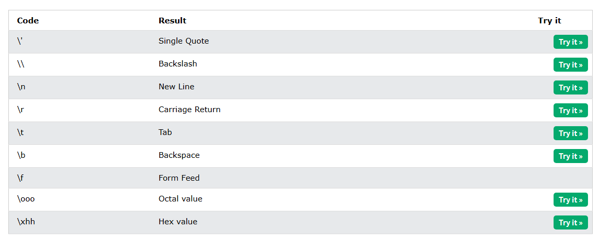

# Strings

- Strings in python are surrounded by either single quotation marks, or double quotation marks.

- 'hello' is the same as "hello".

- You can display a string literal with the print() function:
```
print("It's alright")
print("He is called 'Johnny'")
print('He is called "Johnny"')
```
### Multiline Strings
- You can assign a multiline string to a variable by using three quotes:

```
a = """Lorem ipsum dolor sit amet,
consectetur adipiscing elit,
sed do eiusmod tempor incididunt
ut labore et dolore magna aliqua."""
print(a)

a = '''Lorem ipsum dolor sit amet,
consectetur adipiscing elit,
sed do eiusmod tempor incididunt
ut labore et dolore magna aliqua.'''
print(a)
```

### Strings are Arrays
- Like many other popular programming languages, strings in Python are arrays of unicode characters.

- However, Python does not have a character data type, a single character is simply a string with a length of 1.

- Square brackets can be used to access elements of the string.
```
a = "Hello, World!"
print(a[1])
```
### Looping Through a String
- Since strings are arrays, we can loop through the characters in a string, with a for loop.
```
for x in "banana":
  print(x)
```
### String Length
- To get the length of a string, use the len() function.

```
a = "Hello, World!"
print(len(a))
```

### Check String
- To check if a certain phrase or character is present in a string, we can use the keyword in.
```
txt = "The best things in life are free!"
print("free" in txt)
```
### Check if NOT
- To check if a certain phrase or character is NOT present in a string, we can use the keyword not in.
```
txt = "The best things in life are free!"
print("expensive" not in txt)
```
## Slicing
- You can return a range of characters by using the slice syntax.

- Specify the start index and the end index, separated by a colon, to return a part of the string.
```
b = "Hello, World!"
print(b[2:5])
```
### Slice From the Start
- By leaving out the start index, the range will start at the first character:
```
b = "Hello, World!"
print(b[:5])
```
### Slice To the End
- By leaving out the end index, the range will go to the end:
```
b = "Hello, World!"
print(b[2:])
```
### Negative Indexing
- Use negative indexes to start the slice from the end of the string:
```
b = "Hello, World!"
print(b[-5:-2])
```

## Modify Strings
### Upper Case
```
a = "Hello, World!"
print(a.upper())
```
### Lower Case
```
a = "Hello, World!"
print(a.lower())
```
### Remove Whitespace
```
a = " Hello, World! "
print(a.strip()) # returns "Hello, World!"
```
### Replace String
```
a = "Hello, World!"
print(a.replace("H", "J"))
```
### Split String
- The split() method returns a list where the text between the specified separator becomes the list items.
```
a = "Hello, World!"
print(a.split(",")) # returns ['Hello', ' World!']
```
## String Concatenation
- To concatenate, or combine, two strings you can use the + operator.

```
a = "Hello"
b = "World"
c = a + b
print(c)
```
## Format - Strings
### F-Strings
- F-String was introduced in Python 3.6, and is now the preferred way of formatting strings.

- To specify a string as an f-string, simply put an f in front of the string literal, and add curly brackets {} as placeholders for variables and other operations.
```
age = 36
txt = f"My name is John, I am {age}"
print(txt)
```
### Placeholders and Modifiers
- A placeholder can contain variables, operations, functions, and modifiers to format the value.
```
price = 59
txt = f"The price is {price} dollars"
print(txt)
```
- A placeholder can include a modifier to format the value.

- A modifier is included by adding a colon : followed by a legal formatting type, like .2f which means fixed point number with 2 decimals:

```
price = 59
txt = f"The price is {price:.2f} dollars"
print(txt)
```

### Escape Characters
- To insert characters that are illegal in a string, use an escape character.

- An escape character is a backslash \ followed by the character you want to insert.

- An example of an illegal character is a double quote inside a string that is surrounded by double quotes:

```
txt = "We are the so-called \"Vikings\" from the north."
```



### String Methods
|Method|Description|
|------|-----------|
|capitalize()|Converts the first character to upper case|
|casefold()|Converts string into lower case|
|center()|Returns a centered string|
|count()|Returns the number of times a specified value occurs in a string|
|encode()|Returns an encoded version of the string|
|endswith()|Returns true if the string ends with the specified value|
|expandtabs()|Sets the tab size of the string|
|find()|Searches the string for a specified value and returns the position of where it was found|
|format()|Formats specified values in a string|
|format_map()|Formats specified values in a string|
|index()|Searches the string for a specified value and returns the position of where it was found|
|isalnum()|Returns True if all characters in the string are alphanumeric|
|isalpha()|Returns True if all characters in the string are in the alphabet|
|isascii()|Returns True if all characters in the string are ascii characters|
|isdecimal()|Returns True if all characters in the string are decimals|
|isdigit()|Returns True if all characters in the string are digits|
|isidentifier()|Returns True if the string is an identifier|
|islower()|Returns True if all characters in the string are lower case|
|isnumeric()|Returns True if all characters in the string are numeric|
|isprintable()|Returns True if all characters in the string are printable|
|isspace()|Returns True if all characters in the string are whitespaces|
|istitle()|Returns True if the string follows the rules of a title|
|isupper()|Returns True if all characters in the string are upper case|
|join()|Joins the elements of an iterable to the end of the string|
|ljust()|Returns a left justified version of the string|
|lower()|Converts a string into lower case|
|lstrip()|Returns a left trim version of the string|
|maketrans()|Returns a translation table to be used in translations|
|partition()|Returns a tuple where the string is parted into three parts|
|replace()|Returns a string where a specified value is replaced with a specified value|
|rfind()|Searches the string for a specified value and returns the last position of where it was found|
|rindex()|Searches the string for a specified value and returns the last position of where it was found|
|rjust()|Returns a right justified version of the string|
|rpartition()|Returns a tuple where the string is parted into three parts|
|rsplit()|Splits the string at the specified separator, and returns a list|
|rstrip()|Returns a right trim version of the string|
|split()|Splits the string at the specified separator, and returns a list|
|splitlines()|Splits the string at line breaks and returns a list|
|startswith()|Returns true if the string starts with the specified value|
|strip()|Returns a trimmed version of the string|
|swapcase()|Swaps cases, lower case becomes upper case and vice versa|
|title()|Converts the first character of each word to upper case|
|translate()|Returns a translated string|
|upper()|Converts a string into upper case|
|zfill()|Fills the string with a specified number of 0 values at the beginning|