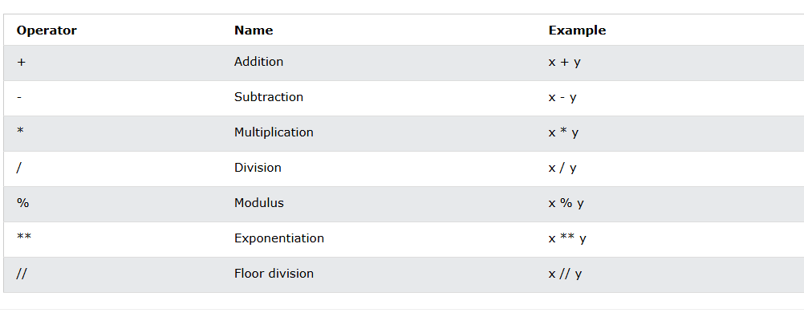
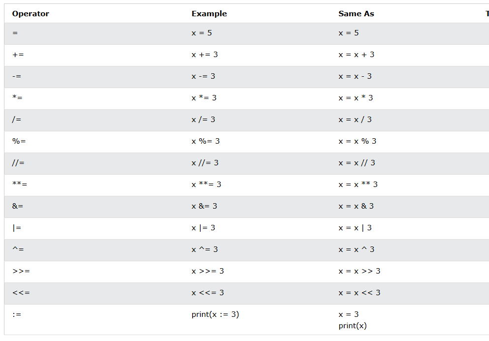
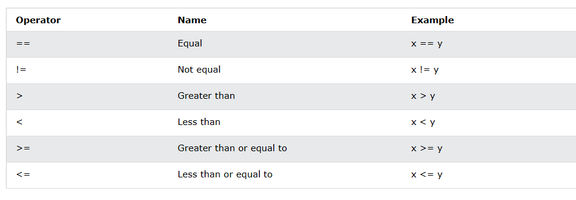
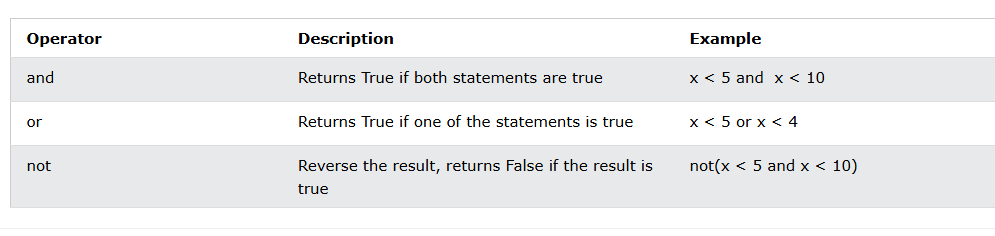
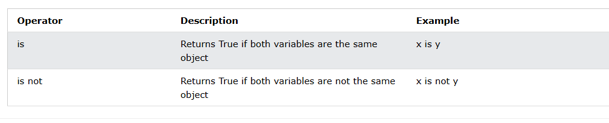
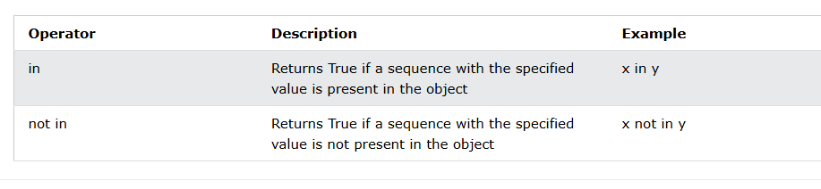
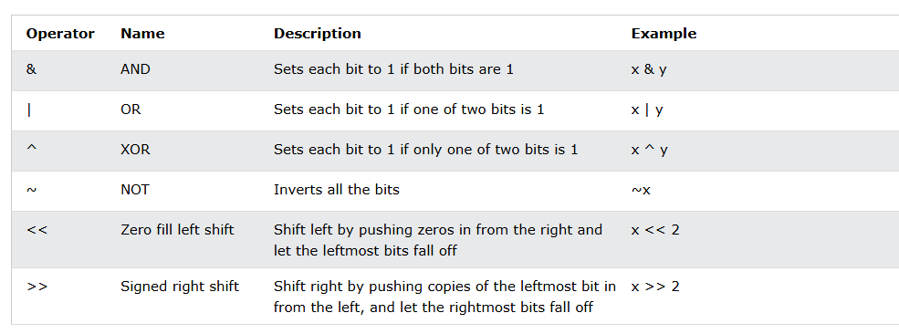
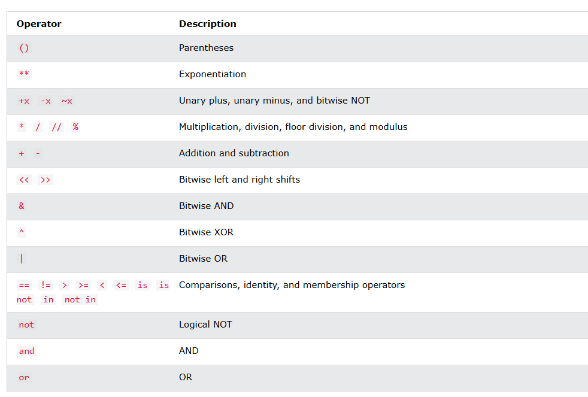

# Operators
- Operators are used to perform operations on variables and values.

- In the example below, we use the + operator to add together two values:

## Arithmetic Operators

## Assignment Operators

## Comparison Operators

## Logical Operators

## Identity Operators

## Membership Operators

## Bitwise Operators

## Operator Precedence
